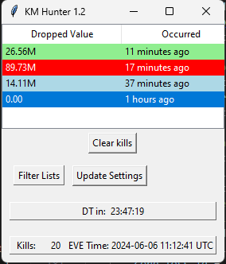

# Killmail hunter for EVE Online



### Changing settings

#### Discord webhook notifications:

Now you can get the notifications delivered directly to your discord server channel of your choosing, or any chat service that supports channel webhooks!
Just create a webhook for that channel in channel settings, and update the file called `.env` with no name, just the file extension. Make sure
it is in the same folder.
Insert your credentials into the `.env` file:

```
FEED_HOOK=YOUR_WEBHOOK_URL
DISCORD_CHANNEL_ID=YOUR_CHANNEL_ID
```

#### Headless mode:

To run in headless mode (No GUI window) start the program from command line using the `km_hunter.exe --no-gui` argument.

#### Settings.json:

- You can adjust which lossmails are shown by editing the `settings.json` file. This is still a WIP and there may be errors in some logic cases.
- If there are identical codes in different filter lists, it will match the item in the first list to be checked and display that one.
- If a filter list is enabled it will only show the killmails with a matching ID in that filter list.

#### What happens when each setting condition is set to true:

`"time_threshold_enabled": true` = will **only** show you lossmails within the timeframe (seconds) as defined in `time_threshold`.

`"time_threshold": 12000` = default timeframe 200 minutes (kills occurring within 3.33 hours).

`"dropped_value_enabled": true` = will only show ships with a dropped value in the shipwreck greater than the entered number as defined in `dropped_value`.

`"dropped_value": 100000000` = default dropped value is 100,000,000 ISK.

`"audio_alerts_enabled": true` = enables or disables all audio alerts for filter lists

#### Default filter list settings:

`"ignore_dropped_value": true` = causes the filter to always ignore dropped value.

`"officers"` = **always shows** ships that die to an officer NPC as defined in `officers.txt`. **ignores dropped item value**

`"abyssals"` = **always shows** ships that die with abyss items whose value is not calculated, as defined in `abyssals.txt`. **ignores dropped item value**

`"blueprints"` = **always shows** ships that die with blueprints whose value is not calculated, as defined in `blueprints.txt`. **ignores dropped item value**

`"mordus"` = **always shows** ships that die to mordus legion belt commander NPCs. **ignores dropped item value**

`"belt_hunters"` = **always shows** when people die to belt commander NPCs. **ignores dropped item value**

`"color": "red"` = background color for the match to display in the GUI.

`"file": "filename.txt"` = location of the `filterlist.text` file.

`"webhook": true` = when a match is found, send a message to your discord channel defined in `.env`

`"enabled": true` = should the filter list be checked? true/false.

`"sound": "filename.wav"` = plays your custom sound when a killmail in the specific filter list is found.

#### Dynamic filter list loading:

You can add your own filter list by

# Development Installation

1. Download the folder
2. Install the latest version of python (I use bundled anaconda)
3. Install the required python packages, along with [Microsoft C++ Build Tools](https://visualstudio.microsoft.com/visual-cpp-build-tools/)
4. `simpleaudio`, `tkinter`, `websockets`, `webbrowser`
5. Make sure that the following files are present in the same folder:
   1. alert.wav
   2. blue_alert.wav
   3. orange_alert.wav
   4. abyssals.txt
   5. blueprints.txt
   6. belters.txt
   7. mordus.txt
   8. officers.txt
   9. settings.json
6. adjust settings.json for personal preferences
7. run `python km_hunter.py`

You can change the alert notification by replacing the `alert.wav`'s, as long as they have the same name.

## Building the executable

1. Install pyinstaller
2. run `pyinstaller -F .\km_hunter.py` (installs without bundles python, separate python install + packages required.)
   Alternatively run `pyinstaller -F --add-binary "C:\path to exe\python.exe;." km_hunter.py`: This will
   pack your python installation and its modules inside the binary.
3. Copy necessary files mentioned in installation to same folder
